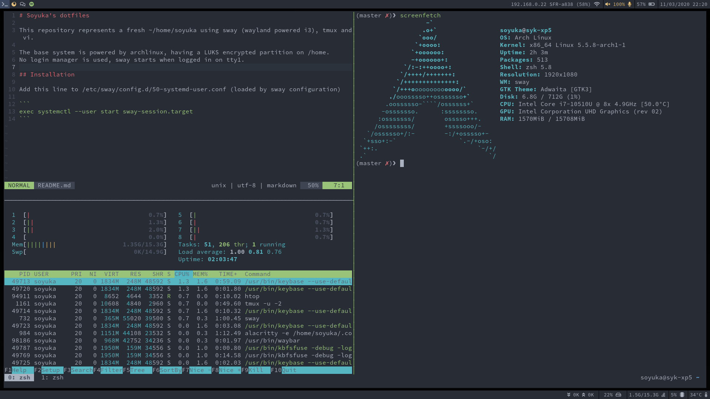

# Soyuka's dotfiles

This repository represents a fresh ~/home/soyuka using sway (wayland powered i3), tmux and vi.

The base system is powered by archlinux, having a LUKS encrypted partition on /home.
No login manager is used, sway starts when logged in on tty1. Colors are based on [OneDark](https://github.com/joshdick/onedark.vim).



## Installation

Add this line to /etc/sway/config.d/50-systemd-user.conf (loaded by sway configuration)

```
exec systemctl --user start sway-session.target
```

Install manually these plugin manager:
 - [zsh (antigen)](https://github.com/zsh-users/antigen) then open zsh
 - [vim (plug)](https://github.com/junegunn/vim-plug) then `vim +PlugInstall`
 - [tmux (tpm)](https://github.com/tmux-plugins/tpm) then `C-a + I`

Follow [hibernation](https://wiki.archlinux.org/index.php/Power_management/Suspend_and_hibernate#Hibernation) instructions.
soyuka should belong to the following groups: `sudo`, `video` (see [brightnessctl](https://github.com/Hummer12007/brightnessctl/issues)).

## Packages list

I use [aurman](https://github.com/polygamma/aurman) to install aur packages.

```
adobe-source-code-pro-fonts
alacritty
alsa-utils
base-devel
blueman
bluez
bluez-utils
brightnessctl
firefox-developer-edition
fzf
git
# screenshot + region (replaces scrot)
grim slurp
# install vim +clipboard
gvim
htop
httpie
jq
# tray fixes blueman ?
libappindicator-gtk3
libnotify
mako
man
# notification
otf-font-awesome
pavucontrol
playerctl
pulseaudio
pulseaudio-alsa
pulseaudio-bluetooth
sudo
swayidle swaylock waybar
syncthing
tmux
unzip zip unrar
vlc
# Replaces arandr (x) on wayland
wdisplays
# xsel/xclip
wl-clipboard-x11 wl-clipboard
# rofi replacement
wofi
xdg-utils
# Note do not install https://wiki.archlinux.org/index.php/Dell_XPS_13_(7390) https://old.reddit.com/r/archlinux/comments/e30f09/complications_when_setting_up_arch_on_the_new/
# xf86-video-intel
xorg
xorg-xinit
zathura
zsh
```
